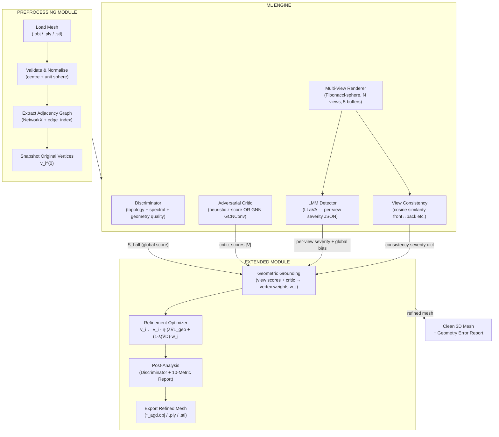
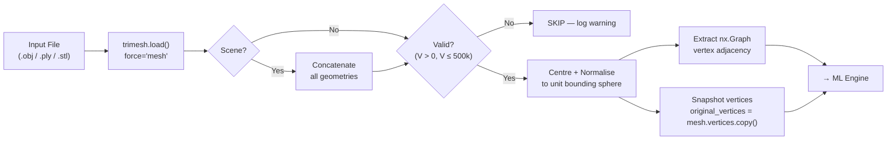
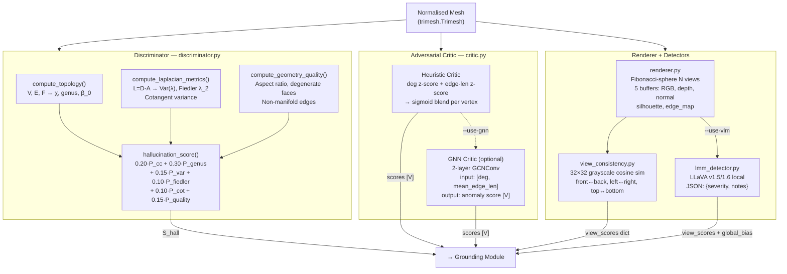
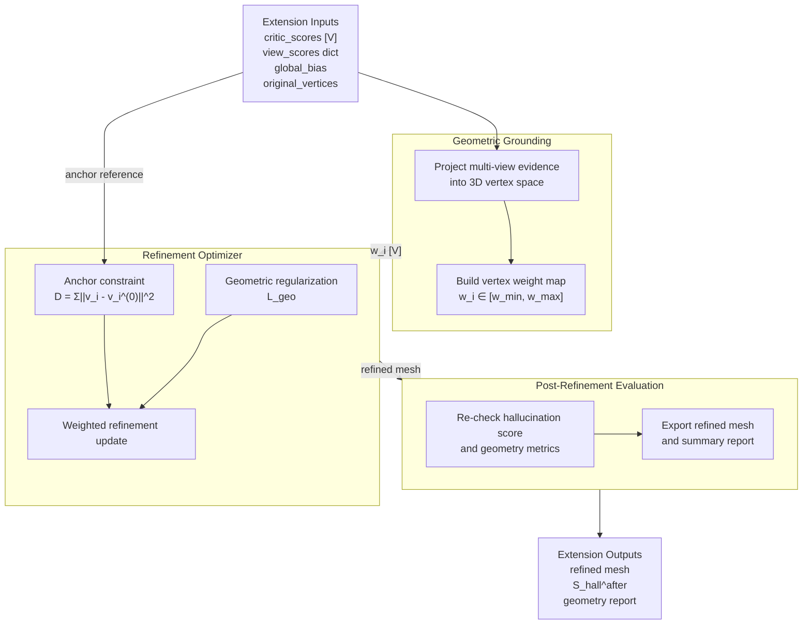
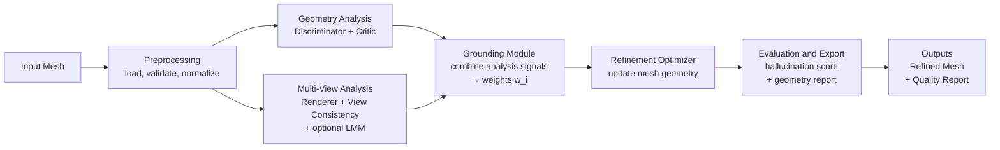

## Diagram 5.1 — Top-Level AGD System Architecture

---

## Diagram 5.2 — Preprocessing Module Data Flow

---

## Diagram 5.3 — ML Engine Internal Architecture

---

## Diagram 5.4 — Extended Module: Grounding and Refinement

---

## Diagram 5.5 — Complete AGD Data Flow and Module Interaction

