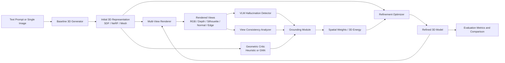

# Project Flow: Adversarial Geometric Distillation (AGD)

## 1. Project Overview

This research focuses on **mitigating hallucinations in text-to-3D generation**, especially geometric errors such as:

- Janus faces
- duplicated parts
- disconnected blobs
- inconsistent front/side/back structure
- poor manifold quality

The main research idea is to build an **Adversarial Geometric Distillation (AGD)** pipeline that does not rely only on text-based correction. Instead, it detects structural problems from multiple rendered views, maps those problems back into 3D space, and refines the geometry using grounded losses.

In simple terms:

1. Generate or load an initial 3D model.
2. Render it from many views.
3. Detect possible hallucinations.
4. Convert detected issues into spatial 3D constraints.
5. Refine the 3D model iteratively.
6. Evaluate whether the refined model is more consistent and topologically cleaner.

## 2. Research Goal

The goal of this research is to design a **closed-loop geometric refinement framework** for 3D generation that reduces hallucinations caused by 2D diffusion priors and weak multi-modal reasoning.

### Main research question

How can multi-view hallucination signals be transformed into **direct 3D geometric constraints** so that text-to-3D systems generate more structurally consistent assets?

### Expected contribution

- A refinement framework on top of baseline text-to-3D generation
- A geometry-aware critic for hallucination localization
- A grounded optimization loop that improves topology and view consistency
- An evaluation setup using geometric and qualitative metrics

## 3. Research Plan

The research can be carried out in the following stages.

### Stage 1: Literature review and gap confirmation

Focus:

- Understand DreamFusion, Magic3D, Fantasia3D, ProlificDreamer, Hallo3D, Perp-Neg, and entropy-based mitigation methods
- Identify why current systems still fail on geometry consistency
- Confirm the research gap around the **semantic bottleneck**

Output:

- literature review
- problem statement
- refined research objectives

### Stage 2: Baseline environment and data setup

Focus:

- Set up the development environment
- Prepare sample meshes and benchmark datasets
- Select base text-to-3D framework and evaluation assets

Output:

- working environment
- sample assets
- reproducible baseline setup

### Stage 3: Baseline 3D generation or mesh intake

Focus:

- Produce an initial 3D object from text or image
- If full SDS integration is not ready, use existing mesh inputs first

Output:

- initial SDF, NeRF, or mesh representation

### Stage 4: Multi-view rendering and view analysis

Focus:

- Render the 3D object from multiple camera angles
- Capture RGB, depth, silhouette, normal, and edge information
- Measure view consistency

Output:

- per-view images
- view-level scores
- visual evidence of hallucinations

### Stage 5: Hallucination detection and critic scoring

Focus:

- Detect structural anomalies using a VLM and geometry-based signals
- Assign local anomaly scores to vertices or regions
- Build a critic that can learn which parts of the mesh are suspicious

Output:

- view-level hallucination report
- per-vertex or per-region anomaly score

### Stage 6: Geometric grounding

Focus:

- Map 2D view-level detections back into 3D space
- Create weight maps or region masks on the mesh
- Build the grounded correction signal

Output:

- grounded vertex weights
- anomaly regions
- spatial correction map

### Stage 7: Refinement loop

Focus:

- Refine the mesh or SDF using geometry loss and distillation loss
- Repeat render -> detect -> ground -> refine
- Stop when the hallucination score improves or converges

Output:

- refined 3D asset
- before/after comparisons

### Stage 8: Evaluation and ablation

Focus:

- Compare baseline and AGD-refined outputs
- Test with and without VLM
- Test heuristic critic vs GNN critic
- Test low-view vs dense-view rendering

Output:

- quantitative metrics
- qualitative figures
- ablation study

## 4. Target System Plan

The final research pipeline should follow this structure.

## 5. Main Components

The main components of the AGD system are below.

| Component | Role in research | Input | Output | Current repo mapping |
|---|---|---|---|---|
| Input interface | Accept prompt, image, or mesh | text, image, mesh | initial task input | future integration + current mesh loading in `agd_pipeline.py` |
| Baseline 3D generator | Produce the first rough 3D model | text or image | SDF / NeRF / mesh | planned using `threestudio` |
| Mesh loader / pre-analysis | Load geometry and compute baseline metrics | mesh file | topology and geometry report | `agd_pipeline.py`, `discriminator.py`, `geometry_metrics.py` |
| Multi-view renderer | Render the object from multiple cameras | mesh | RGB, depth, normal, silhouette, edge views | `renderer.py` |
| View consistency analyzer | Measure cross-view structural consistency | rendered RGB views | per-view inconsistency scores | `view_consistency.py` |
| VLM hallucination detector | Detect visually suspicious artifacts | rendered views | severity scores and notes | `lmm_detector.py` |
| Geometric critic | Score suspicious vertices or regions | mesh geometry | per-vertex anomaly scores | `critic.py`, `gnn_train.py` |
| Grounding module | Convert 2D/view signals into 3D spatial weights | view scores + mesh | vertex bias and region weights | `grounding.py` |
| Refinement optimizer | Update geometry using grounded losses | mesh + weights | refined mesh | `optimizer.py` |
| Evaluation engine | Compare before and after results | original and refined outputs | metrics and analysis | `discriminator.py`, `geometry_metrics.py` |

## 6. Technologies and What They Do

### Core implementation stack

| Technology | Why it is used | Recommended use in this project |
|---|---|---|
| Python | Main research implementation language | Use for all orchestration, experiments, and reporting scripts |
| PyTorch | Deep learning, tensor ops, optimization | Use for critic models, differentiable losses, and training logic |
| Threestudio | Base framework for text-to-3D experiments | Use as the baseline generator instead of building SDS from scratch |
| Hugging Face Diffusers | Access to diffusion building blocks and pipelines | Use when extending or customizing SDS-related generation guidance |
| Trimesh | Mesh loading, topology access, neighborhood queries | Use for mesh IO and fast geometry operations |
| Open3D | Geometry processing and analysis | Use for mesh cleanup, normals, ray casting, registration, and additional analysis |
| PyTorch3D | Differentiable 3D ops and rendering | Use if the refinement loop needs stronger differentiable rendering support |
| PyTorch Geometric | Graph representation and GNN modeling | Use for the geometric critic when moving beyond heuristic scoring |
| Pillow / NumPy / SciPy | Rendering outputs, numerical ops, filters | Keep as the core utility layer |
| Local VLM such as LLaVA-NeXT | Multi-modal inspection of rendered views | Use as a detector, not as the main correction controller |

### Helpful supporting tools

| Tool | Purpose |
|---|---|
| Weights and Biases or MLflow | experiment tracking, metric logging, ablation comparison |
| Jupyter Notebook | fast analysis of results and metric trends |
| Draw.io / Mermaid | architecture and workflow diagrams |
| Git | version control for experiments and report assets |

## 7. Workflow in More Detail

### Step 1: Input stage

- The user provides a text prompt, a single reference image, or an already generated mesh.
- During early experimentation, using existing meshes is acceptable because it allows fast testing of the AGD refinement loop before full SDS integration.

### Step 2: Initial 3D generation

- A base model produces an initial 3D object.
- This may be an SDF, NeRF, Gaussian-based structure, or extracted mesh.
- For AGD, the representation should eventually support conversion into a mesh because geometry-aware refinement is easier on surfaces with vertices, normals, and adjacency.

### Step 3: Multi-view rendering

- The generated mesh is rendered from many camera positions.
- Outputs may include:
  - RGB render
  - depth map
  - silhouette
  - normal map
  - edge or curvature map
- These views give the system cross-view evidence about consistency.

### Step 4: Hallucination detection

- A VLM inspects the views for visible problems such as duplicated faces or impossible structure.
- A consistency module compares different views and scores disagreement.
- A geometric critic analyzes the mesh directly and scores suspicious vertices.

### Step 5: Grounding and linking

- View-level signals are not enough on their own.
- The grounding module maps those signals back to 3D coordinates or vertex regions.
- This step links:
  - rendered view evidence
  - mesh topology
  - vertex normals
  - critic confidence
- The result is a set of spatial weights that tell the optimizer where refinement should be stronger.

### Step 6: Refinement

- The optimizer updates the mesh using a weighted combination of:
  - geometry smoothing or structure-preserving loss
  - distillation or anchor loss to avoid destroying the whole mesh
  - grounded anomaly weights
- This creates a closed loop:
  - render
  - detect
  - ground
  - refine
  - re-render

### Step 7: Evaluation

- Measure whether the refined output has fewer hallucinations and better topology.
- Compare baseline output against refined output visually and numerically.

## 8. Component Linking

This section explains how the main components connect to each other.

| From | To | Why the connection matters |
|---|---|---|
| Input | Baseline generator | Starts the text-to-3D or image-to-3D process |
| Baseline generator | Initial 3D representation | Produces the first object that will be analyzed |
| Initial 3D representation | Multi-view renderer | Converts geometry into images that detectors can inspect |
| Rendered views | VLM detector | Lets the VLM identify visible structural problems |
| Rendered views | View consistency analyzer | Measures disagreement across viewpoints |
| Initial 3D representation | Geometric critic | Gives direct mesh-based anomaly evidence |
| VLM detector + consistency + critic | Grounding module | Combines visual and geometric evidence into spatial constraints |
| Grounding module | Refinement optimizer | Supplies weights or losses to guide correction |
| Refinement optimizer | Refined mesh | Produces improved geometry |
| Refined mesh | Renderer | Enables iterative closed-loop correction |
| Refined mesh | Evaluator | Measures improvement against the baseline |

## 9. What Is Better to Use

This is the most practical stack and design direction for this project.

### Better baseline choice

**Better to use:** `threestudio` as the base text-to-3D framework.

Reason:

- It already supports multiple text-to-3D methods and research-style configuration.
- It is much better than building a raw SDS pipeline from zero for a final-year research project.
- It lets the AGD contribution focus on refinement, which is the real novelty of your work.

### Better geometry representation

**Better to use:** a **mesh-oriented refinement target**, or an SDF pipeline that can reliably export meshes.

Reason:

- Topology metrics, normals, adjacency, Laplacian smoothing, and grounded vertex weights are easier to compute on meshes.
- A pure NeRF-only representation is weaker for direct local geometric correction.

### Better detector strategy

**Better to use:** a **hybrid detector**, not only a VLM.

Recommended combination:

- VLM for visible structural problems
- view consistency metrics for cross-view disagreement
- geometric critic for mesh-local anomaly scoring

Reason:

- A VLM alone may hallucinate or miss subtle spatial defects.
- A geometry-only system may miss semantic duplication patterns such as Janus artifacts.
- The hybrid strategy is more aligned with your proposal and more defensible in the thesis.

### Better critic strategy

**Better to use:** start with a **heuristic critic**, then upgrade to a **GNN critic** after the loop is stable.

Reason:

- The heuristic version is easier to debug and gives a strong baseline.
- The GNN adds research value, but only after meaningful labels, pseudo-labels, or anomaly supervision are available.

### Better view sampling

**Better to use:** **dense multi-view sampling**, ideally Fibonacci-sphere distribution.

Reason:

- Six canonical views are useful for fast tests, but they can miss hallucinations between views.
- Dense view coverage is better for reliable detection and stronger evaluation.

### Better loss design

**Better to use:** a weighted combination of:

- geometry regularization
- anchor or distillation loss
- grounded anomaly weighting

Reason:

- Geometry regularization alone may oversmooth the model.
- Distillation alone may preserve the hallucination.
- Grounded weighting makes correction local and controlled.

### Better evaluation setup

**Better to use:** benchmark meshes and standard datasets such as `Objaverse` and `Google Scanned Objects`, plus a controlled set of hard examples with obvious hallucinations.

Reason:

- This gives both quantitative benchmarking and convincing visual examples.
- It also makes the thesis stronger than showing only a few handpicked meshes.

### Better experimental order

**Better to use this order:**

1. Validate the refinement loop on existing meshes.
2. Validate multi-view detection and grounding.
3. Compare heuristic critic vs GNN critic.
4. Add baseline text-to-3D integration.
5. Run full evaluations and ablations.

Reason:

- This reduces risk.
- It allows you to prove the AGD idea before solving the full generation problem.

## 10. Recommended Final Architecture for This Project

For this research, the most balanced final design is:

- `Threestudio` for the base text-to-3D generator
- `PyTorch` for optimization and learning
- `Trimesh + Open3D` for geometry processing
- `PyTorch Geometric` for the learned critic
- `LLaVA-NeXT` as a local VLM detector
- `Dense multi-view rendering` for reliable evidence collection
- `Mesh-based grounded refinement` for controllable correction

This combination is better than a text-only correction system because it keeps the feedback loop tied to actual 3D structure.

## 11. Practical Mapping to the Current Repo

The current repository already covers a good part of the AGD pipeline in prototype form.

| Current file | Role |
|---|---|
| `agd_pipeline.py` | overall orchestration pipeline |
| `renderer.py` | multi-view rendering and view schedule generation |
| `lmm_detector.py` | VLM-based view inspection |
| `view_consistency.py` | cross-view consistency scoring |
| `critic.py` | heuristic and optional GNN critic |
| `grounding.py` | mapping view signals to vertex weights |
| `optimizer.py` | iterative mesh refinement |
| `discriminator.py` | topology and spectral analysis |
| `geometry_metrics.py` | geometry comparison metrics |
| `gnn_train.py` | critic training scaffold |

### Current maturity

- The repo already supports **mesh-based AGD refinement**.
- The largest remaining research upgrade is **full SDS/text-to-3D integration** and stronger **research-grade evaluation**.

## 12. Suggested Next Steps

1. Stabilize the current mesh refinement loop and metric logging.
2. Add experiment tracking for before/after comparisons.
3. Improve the grounding stage from coarse directional mapping to projection-based mapping.
4. Train the GNN critic using pseudo-labels first, then better supervision if available.
5. Integrate AGD with a baseline `threestudio` text-to-3D pipeline.
6. Run ablation studies on:
   - no VLM
   - no critic
   - no grounding
   - sparse views vs dense views
   - heuristic critic vs GNN critic

## 13. Useful References for the Technology Choices

- Threestudio: [https://github.com/threestudio-project/threestudio](https://github.com/threestudio-project/threestudio)
- Diffusers documentation: [https://huggingface.co/docs/diffusers/index](https://huggingface.co/docs/diffusers/index)
- PyTorch3D documentation: [https://pytorch3d.org/docs/why_pytorch3d](https://pytorch3d.org/docs/why_pytorch3d)
- Open3D documentation: [https://www.open3d.org/docs/latest/index.html](https://www.open3d.org/docs/latest/index.html)
- PyTorch Geometric documentation: [https://pytorch-geometric.readthedocs.io/en/latest/get_started/introduction.html](https://pytorch-geometric.readthedocs.io/en/latest/get_started/introduction.html)
- LLaVA-NeXT repository: [https://github.com/LLaVA-VL/LLaVA-NeXT](https://github.com/LLaVA-VL/LLaVA-NeXT)

## 14. Final Summary

This project should be treated as a **geometry-aware refinement framework for 3D generation**, not just another detector. The strongest version of the research is a system where:

- a baseline model generates the first 3D output,
- multiple views expose structural inconsistencies,
- a critic and detector identify suspicious regions,
- a grounding module converts those findings into local 3D constraints,
- and a refinement loop iteratively improves the model.

That is the clearest and strongest flow for both your implementation and your thesis explanation.
